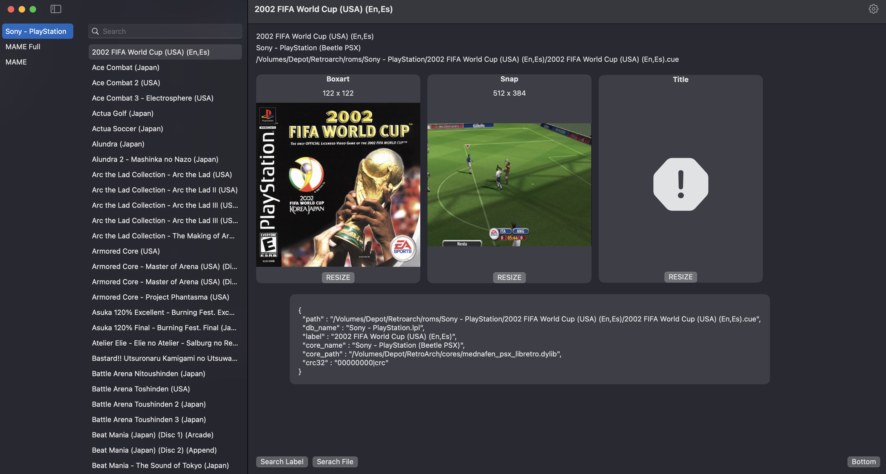

# Playlist Manager for RetroArch on MacOS

A standalone macOS application for editing and managing RetroArch playlists.

preview

# Features
- Copy game to another playlist
- Remove game
- Rename game
- Paste thumbnail image from clipboard
