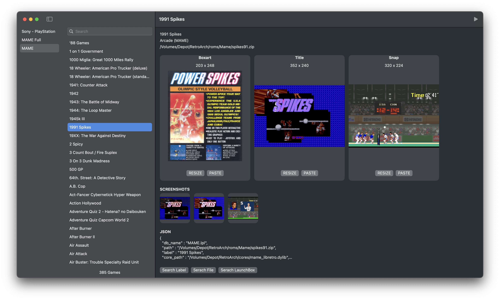

# Playlist Manager for RetroArch on MacOS

A standalone macOS application for editing and managing RetroArch playlists.

## ⚠️**WARNING**
- This application is under development.
- There is a possibility that your playlist may be damaged due to unexpected errors, so please always make a backup first.
- Modifying or deleting thumbnails is irreversible and cannot be undone, regardless of whether you have saved your changes.
- ***Use it at your own risk.***

## Features
- Copy game to another playlist
- Remove game
- Rename game
- Duplicate game
- Paste thumbnail image from clipboard
- Resize thumbnail
- Instant play game
